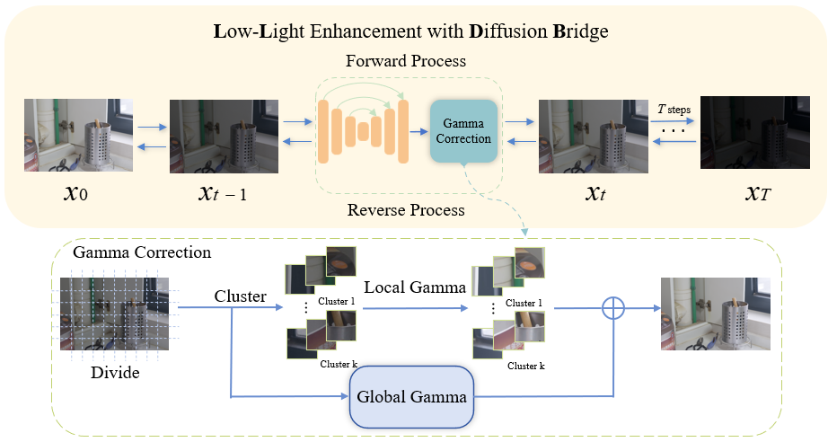
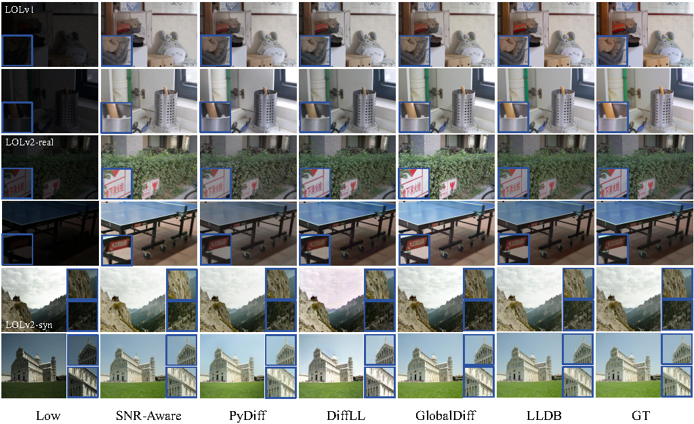

<h1 align="center"> LLDB: Efficient Low-light enhancement with Difffusion Bridge </h1>

This paper investigates a method for solving low-light image enhancement problems based on the diffusion bridge framework. Currently, low-light enhancement tasks still face challenges in noise removal and detail recovery, and existing diffusion model methods suffer from slow speed and large parameter counts. We conducted an in-depth study of the diffusion bridge theory, integrating its advantages and employing a nonlinear activation network to further improve the low-light enhancement task. Additionally, we used a Gamma correction module for fine-tuning low-light images, significantly improving performance with almost no extra computational cost. Experiments show that Low-Light enhancement with Difffusion Bridge (LLDB) far surpasses other methods on the LOLv1, LOLv2-real and LOLv2-syn datasets.

# Overview

    

# Visual Results

     

# Intallation
This code is developed with Python3, and we recommend python>=3.8 and PyTorch ==1.13.0. Install the dependencies with Anaconda and activate the environment with:

    conda create --name LLDB python=3.8
    conda activate LLDB
    pip install -r requirements.txt

# dataset

LOL: Chen Wei, Wenjing Wang, Wenhan Yang, and Jiaying Liu. "Deep Retinex Decomposition for Low-Light Enhancement", BMVC, 2018. [[Baiduyun (extracted code: sdd0)\]](https://pan.baidu.com/s/1spt0kYU3OqsQSND-be4UaA) [[Google Drive\]](https://drive.google.com/file/d/18bs_mAREhLipaM2qvhxs7u7ff2VSHet2/view?usp=sharing)
LOL-v2 (the extension work): Wenhan Yang, Haofeng Huang, Wenjing Wang, Shiqi Wang, and Jiaying Liu. "Sparse Gradient Regularized Deep Retinex Network for Robust Low-Light Image Enhancement", TIP, 2021. [[Baiduyun (extracted code: l9xm)\]](https://pan.baidu.com/s/1U9ePTfeLlnEbr5dtI1tm5g) [[Google Drive\]](https://drive.google.com/file/d/1dzuLCk9_gE2bFF222n3-7GVUlSVHpMYC/view?usp=sharing)

DCM, LIME, MEF, NPE and VV datasets can obtain here [CVPR-2020-Semi-Low-Light](https://github.com/flyywh/CVPR-2020-Semi-Low-Light)

# Test

1. Prepare datasets.
2. Download pretrained checkpoints [[Baiduyun (extracted code: r4kj)]](https://pan.baidu.com/s/1QVcKtUJTreIVlXHw3p4flw).
3. Modify options, including dataroot_GT, dataroot_LQ and pretrain_model_G.
5. `python test.py -opt=options/test.yml`

The Test results will be saved in `\results`.

# Train
1. Prepare datasets.
2. Modify options, including dataroot_GT, dataroot_LQ.
3. `python train.py -opt=options/train.yml` for single GPU.  `python -m torch.distributed.launch --nproc_per_node=2 --master_port=1111 train.py -opt=options/train.yml --launcher pytorch` for multi GPUs. *Attention: see [Important Option Details](#important-option-details)*.

The Training log will be saved in `\experiments`.

